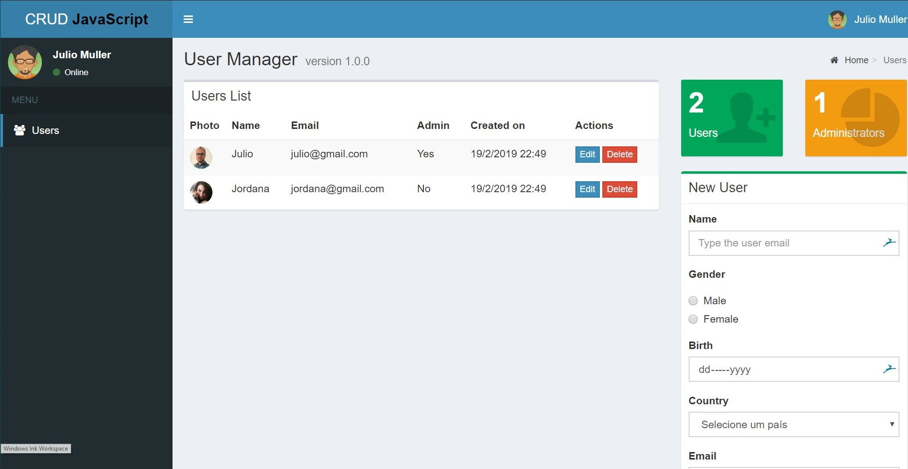

# Simple JavaScript CRUD Application

- **JavaScript developed by:** [Julio L. Muller](https://github.com/juliolmuller)
- **HTML & CSS delivered by:** [Hcode Treinamentos](https://www.hcode.com.br)
- **Released on:** Jan 28, 2019
- **Updated on:** Nov 3, 2019
- **Latest version:** 1.1.2
- **License:** *MIT*

## Overview

Application developed to demonstrate a functional CRUD application (create, read, update & delete data) using vanilla JavaScript (no framework). This a front-end application which uses browser local storage (no data is set to the server or stored remotely).

## Run Application

Take a look at this application running through [this link](https://juliolmuller.github.io/crud-javascript).

## Resources

Yet to come...
